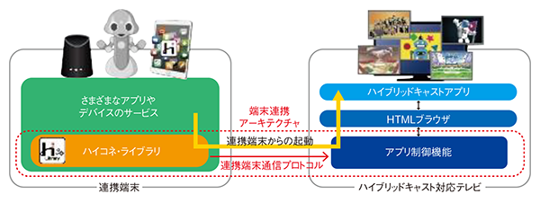

# hyconet4j

Hybridcast-Connect reference SDK for Java | "ハイコネライブラリ" for Java


## Overview

"hyconet4j" is the java based reference implementation SDK of the "Hybridcast-Connect" that was standardized at Sep.2018 in IPTV Forum Japan. Hybridcast-Connect can realize to control some parts of the functions of a tuner on a TV Set from a application outside of the tuner , and communicate with text message between the TV Set and some applications.
The OSS, "hyconet4j" is the part of the test tool that has been utilized as conformance test tool of the "Hybridcast-Connect" protocol in IPTV Forum Japan.

For more detail, see [Hybridcast-Connect instruction](./HybridcastConnect.md). For use of "hyconet4j", see [LICENSE](./LICENSE.txt) and [NOTICE](./NOTICE.txt).


hyconet4jは、IPTV Forum Japanにおいて2018年９月に標準規格化された「ハイブリッドキャストコネクト」(以後、ハイコネ)のプロトコルを使うためのリファレンスSDK実装（ハイコネライブラリのJava実装）です。ハイコネを利用すると、放送受信機能の一部の制御を受信機外のアプリケーションから実行でき、その受信機および受信機上のHybridcastサービスのブラウザアプリケーションと通信もできます。本SDKはハイブリッドキャストコネクトのプロトコルテストで利用されているツールの一部をOSS化したものです。

詳しくは、[About "Hybridcast-Connect"](./HybridcastConnect.md)を参照ください。本ソフトウェアの利用に関しては、LICENSEおよびNOTICEファイルを参照ください。



- Reference
    - ["Hybridcast-Connect" Overview](./HybridcastConnect.md)
    - [IPTVFJ STD-0013 "ハイブリッドキャスト運用規定(Hybridcast Operational Guideline)"](https://www.iptvforum.jp/download/input.html)
    - [W3C TPAC2018 Media&Entertainment IG "RecentAchievementOfHybridcast in TPAC2018"](https://www.w3.org/2011/webtv/wiki/images/4/45/RecentAchievementHybridcast_TPAC20181022.pdf)
    - [W3C TPAC2019 Media&Entertainment IG "RecentAchievementOfHybridcast in TPAC2019"](https://www.w3.org/2011/webtv/wiki/images/d/d1/MediaTimedEventsInHybridcast_TPAC20190916.pdf)

## Environment

- Java8-SE(JDK8-191+)互換JDK
    - OpenJDK 8+
    - Amazon Corretto 8+
- Android0S 8+ に組込ライブラリとして動作
- gradle(4.10+)でのコンパイル

## Build

run gradle commmand as follows.

gradleを利用してjarを生成する。

```bash
# gradleでビルド
$ ./gradlew
# buildフォルダにjarを生成
$ ls ./build/libs
>> hyconet4j-x.y.z.jar
```

## Directories

### ./sample


- Test*.java（サンプルコード)
- build.gradle（ビルド設定）
- test.sh (サンプル実行用スクリプト)
- build_run.sh（サンプルコードのgradleビルドとtest.shサンプル実行までの一括スクリプト）

### ./libs

Libraries copied from build directory after building "hyconet4j" from source.

ビルド後にライブラリ一式がコピーされるディレクトリ

- Jar package as SDK Library | ソースコードからbuildしたライブラリ本体

    - hyconet4j-x.y.z.jar

- Dependencies

    - commons-codec-1.10.jar
    - netty-buffer-4.1.23.Final.jar
    - netty-codec-4.1.23.Final.jar
    - netty-codec-http-4.1.23.Final.jar
    - netty-common-4.1.23.Final.jar
    - netty-resolver-4.1.23.Final.jar
    - netty-transport-4.1.23.Final.jar
    - cybergarage-upnp-core-2.1.1.jar (NOTICE: see [License](#license))
    - JSON-java-20170220.jar (NOTICE: see [License](#license))

### ./build

directory generated when building "hyconet4j" from source.

ビルド時にgradleにより自動作成される。ビルド後は不要。


### ./docs

Reference documents.

Reference Documentsのディレクトリ。実装の例は./sampleを参照。

- [hccp-apidocs.md](./docs/hccp-apidocs.md)

    Simple API reference  of "hyconet4j" and examples of these APIs. For more detail, see javadoc generated when building "hyconet4j" from source.

    ハイコネプロトコルSDKの提供するAPIとそのexample。
    詳細はgradleによるビルド時に生成されるjavadocを参照。(build/docs/javadoc/index.html)

---

## HowToUse

### Example


```java
import jp.or.nhk.rd.hyconet4j.TVRCMan;
import jp.or.nhk.rd.hyconet4j.TVRCStatus;
import jp.or.nhk.rd.hyconet4j.TVRCDevinfo;

//機器サーチと発見時のコールバック処理指定
TVRCMan tvrcman = new TVRCMan() {
        int devcount = 0;
        public void onDeviceRegistered(TVRCDevinfo devinfo) {
            System.out.print("Device Found[" + devcount++ + "]: " );
        }
}
// 7秒毎の機器サーチ実行。機器が見つかったら終了。
while(true){
    tvrcman.search_start();
    try{
        Thread.sleep(7000);
    }catch(InterruptedException e){ }
    tvrcman.search_stop();
    // 機器が見つかったらサーチ終了。
    if (tvrcman.getTVRCDevList().size() >= 1){
        break;
    }
}

// サーチした機器からデバイスのオブジェクトを取得
ListTVRCDevinfo devlist = TVRCMan.getTVRCDevList();

// 実行対象のデバイスのオブジェクトを選択
TVRCDevinfo tvdev = TVRCMan.getTVRCDevinfo(int index);


///////////////// Hybridcast-Connect APIs //////////////////////
//
//////// 外部起動API
//
// 利用可能メディア(TD:地上波、BS、CS)
status = tvdev.getAvailableMedia();
// 受信機が選局可能な地上波のチャンネル（編成チャンネル）一覧
status = tvdev.getChannelInfo("TD");

// 選局・ハイブリッドキャスト起動のためのオブジェクト作成
JSONObject appInfo =
    new JSONObject()
        .put("resource", new JSONObject()  // 編成チャンネルリソースオブジェクト: 放送局とサービスメディアを特定
            .put("original_network_id", 32736
            .put("transport_stream_id", 32736)
            .put("service_id", 1024))
        .put("hybridcast", new JSONObject()  // Hybridcastオブジェクト: 外部起動するHCアプリのリソース情報
            .put("orgid", 16)  // Hybridcastアプリに割り当てられたorgid
            .put("appid", 1)   // Hybridcastアプリに割り当てられたappid
            .put("aiturl", "http://example.com/ait/sample.ait")  // 起動したいHCアプリのAIT(ApplicationInformationTable)のURL--AITファイルにwebアプリのURLが記述されている
        );
// 選局要求のみ
status = tvdev.startAITControlledApp( "tune", appInfo.toString() );
// 選局+Hybridacst起動要求
status = tvdev.startAITControlledApp( "app", appInfo.toString() );

// 起動要求成否取得
status = tvdev.getTaskStatus();

// 受信機状態（ブラウザ起動状態など）取得
status = tvdev.getReceiverStatus();


//////// 連携端末プロトコルAPI

// websocketメッセージ受信用Listener -- 以下のcallback用Interfaceを実装してHCListenerにセット、
tvdev.setHCListener(new HCListener() {
    @Override
    public void wsDataReceived(String str) {
        System.out.println( "*** TestTVRC::wsDataReceived" );
        System.out.println( "websocketReceivedMessage=" + str );
    }
   }
});

// 端末連携のwebsocket接続
tvdev.connWebsocket();

// websocketでのメッセージ送信
tvdev.sendWebsocket("---message string---");

// 端末連携のwebsocket接続
tvdev.disconnWebsocket();
```

For more informatin, see [APIDOCS](./docs/apidocs.md) or sample source code.

この他、APIドキュメントまたはサンプルコードを参照。


---

## Sample Code Package

### Sample

The sample shows how to run the APIs of "hyconet4j" SDK.

Discovery -> Get the list of devices -> select device -> call APIs of "hybridcast-Connect" as a client.

機器探索->機器一覧取得->機器接続（選択）->各APIのコマンドラインを使った実行ができるサンプル。

```
.
├── TestHCEX.java              -- sample source. | サンプルソースコード
├── build.gradle                -- gradle setting file. | サンプルコードをgradleでビルドするための設定
├── test.sh                    -- runner of the sample. | サンプルコードの実行

```

- run the sample as like command-ine tool

The sample can run by inputting command as like command-line tool.

The input command can be interpreted as follows.

    - "VK_X" or "X" are interpreted as the same command.
    - Available commands are listed in sample source. Typing "help" command can also shows the breif list of the commands.

コマンドラインの入力で各APIを実行できる。

    - VK_の入力は省くようにサンプルは作っている
    - 入力できるコマンドは各サンプルのソースコードをみること。"help"コマンドを入力すると簡易的なコマンドリストを参照することもできる。cmdid.eauals("VK_1")など。

```bash
# Waiting for user input. | サンプル実行時のコマンドライン入力待ち状態

--)  1
（It is equivalent to the command "VK_1". | VK_1に相当するコマンド。

--) getchannels
（It is equivalent to the command "VK_getchannels". | VK_getchannelsに相当するコマンド。
```

### How to run the sample

The sample runs as follows.

サンプルは以下で実行できる。

```bash
$ cd sample
$ ./gradlew
$ ./test.sh
```

# License

See [LICENSE.txt](./LICENSE.txt) and [NOTICE.txt](./NOTICE.txt).

本ソフトウェアのライセンスについては[LICENSE.txt](./LICENSE.txt)および[NOTICE.txt](./NOTICE.txt)を参照。


---

And see additional side information: "hyconet4j" repository includes third party's oss jar packages themselves  below in some reason:

なお、本リポジトリには以下理由によりOSSパッケージを含みます。


- cybergarage-upnp-core-2.1.1.jar

    - Repository: https://github.com/cybergarage/cybergarage-upnp
    - LICENSE: https://github.com/cybergarage/cybergarage-upnp/blob/master/LICENSE.txt

    [当OSSのドキュメントに記載のMavenRepositoryのリンク](http://www.cybergarage.org:8080/maven/repo/)が不安定なため、当OSSを`maven install`して生成したjar package "cybergarage-upnp-core-2.1.1.jar"を本"hyconet4j"リポジトリは同梱

    Cybergarase Public Repository can not be available frequently, so in a solution, this "hyconet4j" repository includes static jar package "cybergarage-upnp-core-2.1.1.jar" that is built with `maven install` from source code.

- JSON-java-20170220.java

    - Repository: https://github.com/stleary/JSON-java
    - LICENSE: https://github.com/stleary/JSON-java/blob/master/LICENSE

    JSONのjava実装のスタンダートのため利用。ただし、androidで利用する場合、[当OSSのpackageName "org.json"が競合する](https://github.com/stleary/JSON-java/wiki/JSON-Java-for-Android-developers)ため、本"hyconet4j"リポジトリにおいてはandroidでの利用を想定して、packageNameを"JSON-java"へ変更し、同梱して利用。

    It is the standard Java implementation in JSON. But for Android Develepment, there's [confliction problem between JSON-java and android](https://github.com/stleary/JSON-java/wiki/JSON-Java-for-Android-developers), then this "hyconet4j" repository soloves the problem by changing package name from "org.json" to "JSON-java".


